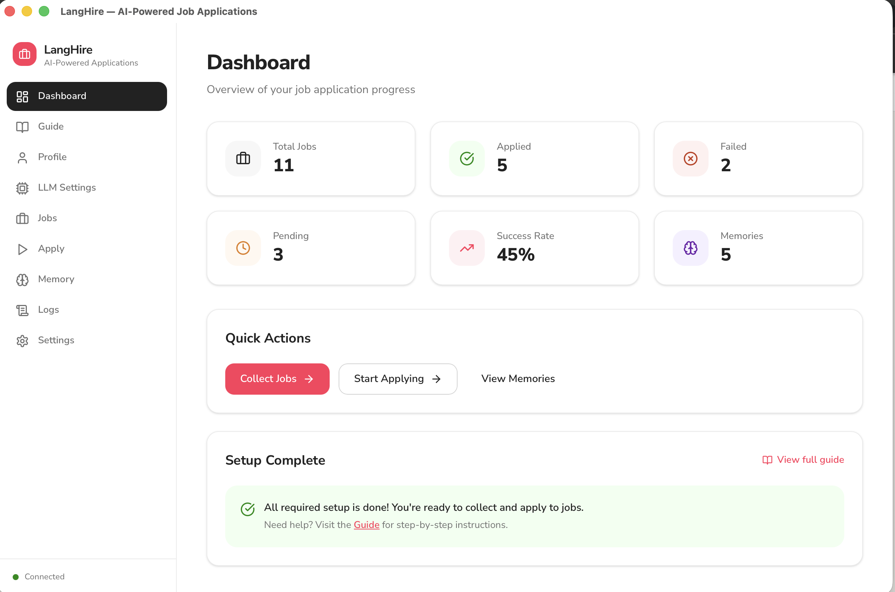
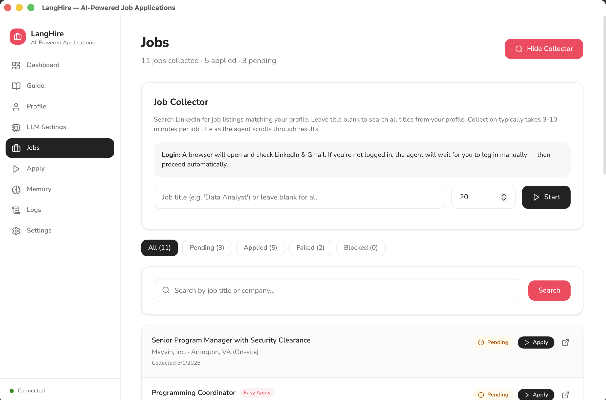
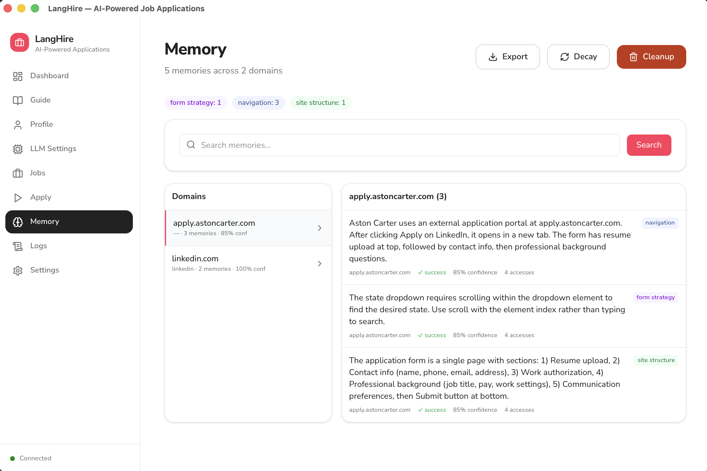

<p align="center">
  
</p>

<h1 align="center">JobFlow-AI</h1>

<p align="center">
  <strong>AI-aangedreven automatisering van sollicitaties met een native desktop-interface</strong>
</p>

<p align="center">
  
  
  
  
  
  
  <a href="LICENSE"></a>
</p>

<p align="center">
  <a href="../README.md">English</a> &middot;
  <a href="README.hi.md">हिन्दी</a> &middot;
  <a href="README.de.md">Deutsch</a> &middot;
  <a href="README.fr.md">Français</a> &middot;
  <a href="README.es.md">Español</a> &middot;
  <a href="README.ar.md">العربية</a> &middot;
  <a href="README.nl.md"><strong>Nederlands</strong></a> &middot;
  <a href="README.ja.md">日本語</a> &middot;
  <a href="README.ko.md">한국어</a> &middot;
  <a href="README.pt.md">Português</a> &middot;
  <a href="README.ms.md">Bahasa Melayu</a>
</p>

---

Solliciteren is vervelend. Je vindt een vacature, klikt door naar de sollicitatie, vult dezelfde velden in als gisteren, beantwoordt dezelfde screeningvragen, uploadt je cv opnieuw — herhaal vijftig keer. JobFlow-AI automatiseert de hele cyclus.

Het gebruikt AI-browseragenten om LinkedIn te doorzoeken, passende vacatures te verzamelen, sollicitaties in te vullen, je cv te uploaden en te versturen — terwijl een **zelflerend geheugenssysteem** onthoudt hoe elk applicant tracking system (ATS) werkt, zodat het steeds sneller en nauwkeuriger wordt. Alles draait lokaal op je machine. Er verlaten geen gegevens je computer behalve LLM API-aanroepen.

---

## Download

<div align="center">

|  macOS |  Windows |  Linux |
|:---:|:---:|:---:|
| [**Apple Silicon (.dmg)**](https://github.com/vishnu/JobFlow-AI/releases/latest/download/JobFlow-AI_1.0.0_aarch64.dmg) | [**64-bit Installer (.exe)**](https://github.com/vishnu/JobFlow-AI/releases/latest/download/JobFlow-AI_1.0.0_x64-setup.exe) | [**AppImage (Universal)**](https://github.com/vishnu/JobFlow-AI/releases/latest/download/JobFlow-AI_1.0.0_amd64.AppImage) |
| [Intel (.dmg)](https://github.com/vishnu/JobFlow-AI/releases/latest/download/JobFlow-AI_1.0.0_x64.dmg) | | [Debian / Ubuntu x64 (.deb)](https://github.com/vishnu/JobFlow-AI/releases/latest/download/JobFlow-AI_1.0.0_amd64.deb) |
| | | [Debian / Ubuntu ARM64 (.deb)](https://github.com/vishnu/JobFlow-AI/releases/latest/download/JobFlow-AI_1.0.0_arm64.deb) |

</div>

<p align="center"><sub>Vereist een LLM API-sleutel (OpenAI, Anthropic of AWS). Chromium wordt automatisch geïnstalleerd bij de eerste keer starten. Zie <a href="#snelstart">Snelstart</a>.</sub></p>

> **Ontwikkelaars** -- Zie [Ontwikkelomgeving](#ontwikkelomgeving) om vanuit de broncode te draaien.

### Installatie-opmerkingen

<details>
<summary><strong>macOS</strong></summary>

De macOS-release is **ondertekend en genotariseerd** door Apple. Open gewoon de `.dmg`, sleep JobFlow-AI naar Programma's en dubbelklik om te starten. Geen extra stappen nodig.
</details>

<details>
<summary><strong>Windows</strong> -- "Windows heeft uw pc beschermd" (SmartScreen)</summary>

Het Windows-installatieprogramma is niet code-ondertekend. Mogelijk ziet u een SmartScreen-waarschuwing:

1. Voer het `.exe`-installatieprogramma uit
2. Als u **"Windows heeft uw pc beschermd"** ziet:
   - Klik op **Meer info**
   - Klik op **Toch uitvoeren**
3. Voltooi het installatieprogramma en start JobFlow-AI
</details>

<details>
<summary><strong>Linux</strong> -- AppImage of .deb</summary>

**AppImage:**
```bash
chmod +x JobFlow-AI_1.0.0_amd64.AppImage
./JobFlow-AI_1.0.0_amd64.AppImage
```

**Debian / Ubuntu:**
```bash
# Install uv package manager (required for browser management)
curl -LsSf https://astral.sh/uv/install.sh | sh

# Install the app
sudo dpkg -i JobFlow-AI_1.0.0_arm64.deb
```

> [!TIP]
> **Als Chromium niet start:** Sommige Linux-distributies (zoals Ubuntu 24.04+) hebben sandbox-beperkingen. Voer dit uit om browsers en afhankelijkheden handmatig te installeren:
> ```bash
> uvx playwright install --with-deps chromium
> ```
</details>

---

## Functies

- **Native desktop-app** -- macOS, Windows en Linux
- **Vacature-verzameling** -- Doorzoekt LinkedIn naar vacatures die overeenkomen met je doeltitels en locaties
- **Geautomatiseerde sollicitaties** -- AI-agent vult formulieren in, uploadt je cv, beantwoordt screeningvragen
- **Op maat gemaakte cv's** (bèta) -- Past je cv automatisch aan voor elke functiebeschrijving
- **Zelflerend geheugen** -- Slaat procedurele kennis per ATS op (navigatiepatronen, formulierstrategieën, UI-eigenaardigheden). Lessen van één Workday-site gelden voor alle Workday-sites.
- **Slimme Q&A-hergebruik** -- Leert antwoorden van eerdere sollicitaties en hergebruikt ze
- **Multi-LLM-ondersteuning** -- OpenAI, Anthropic, AWS Bedrock of Ollama voor lokale modellen
- **Dashboard** -- Realtime statistieken, slagingspercentages, prestaties per domein, geheugenimpactanalyse
- **CLI-tools** -- Power-user scripts voor verzameling, sollicitatie, geheugenbeheer en analytics
- **100% lokaal** -- Alle gegevens worden opgeslagen op je machine in de app-gegevensmap van je OS

---

## Screenshots

<table>
<tr>
<td align="center" width="33%">
<details>
<summary><br/><strong>Dashboard</strong></summary>

</details>
</td>
<td align="center" width="33%">
<details>
<summary><br/><strong>Vacatures</strong></summary>

</details>
</td>
<td align="center" width="33%">
<details>
<summary><br/><strong>Geheugen</strong></summary>

</details>
</td>
</tr>
</table>

<p align="center"><sub>Klik op een screenshot om te vergroten</sub></p>

---

## Snelstart

1. **Download en installeer** vanuit de [Download](#download)-sectie hierboven
2. **Open de app** -- Chromium wordt automatisch gedownload bij de eerste start (~400 MB, eenmalig)
3. **Installatiewizard** begeleidt je door: **LLM-provider** → **CV uploaden** (parseert automatisch je profiel) → **Profiel controleren** → Klaar
4. **Vacatures verzamelen** -- ga naar **Jobs** → voer een functietitel in → **Start Collecting**
5. **Solliciteren** -- ga naar **Apply** → **Start Applying** en bekijk het dashboard terwijl sollicitaties binnenkomen

---

## Hoe het werkt

JobFlow-AI draait een drieledige lus: **Verzamelen → Solliciteren → Leren**.

**Verzamelen** -- Een AI-browseragent logt in op LinkedIn, zoekt naar vacatures die overeenkomen met je doeltitels en locaties, en slaat elke listing op met URL, bedrijf, titel en beschrijving.

**Solliciteren** -- Voor elke openstaande vacature opent de agent de sollicitatie (Easy Apply of extern ATS), vult elk veld in met je profiel, uploadt je cv, beantwoordt screeningvragen uit zijn Q&A-bank en verstuurt. Meerdere workers kunnen parallel draaien.

**Leren** -- Na elke sollicitatie haalt het systeem procedurele lessen eruit: welke knoppen te klikken, hoe formulieren zijn opgebouwd, wat faalt en wat werkt. Deze herinneringen worden per ATS-domein opgeslagen met betrouwbaarheidsscores, zodat het de volgende keer dat het hetzelfde ATS tegenkomt, al weet hoe te navigeren.

### Architectuur

```
┌──────────────────────────────────────────────────┐
│              Tauri Desktop Shell (Rust)           │
│     Lightweight native wrapper, ~10 MB           │
└────────────────────┬─────────────────────────────┘
                     │ spawns sidecar
                     ▼
┌──────────────────────────────────────────────────┐
│  React Frontend          │  FastAPI Backend      │
│  (TypeScript)            │  (Python sidecar)     │
│                          │                       │
│  - Dashboard             │  - browser-use agents │
│  - Profile editor        │  - Playwright browser │
│  - LLM settings          │  - Memory system      │
│  - Job browser           │  - Multi-LLM factory  │
│  - Apply controls        │  - 20+ REST endpoints │
│  - Memory viewer         │                       │
│          ◄── HTTP localhost:8742 ──►             │
└──────────────────────────────────────────────────┘
                     │
                     ▼
        SQLite + JSON (OS app data directory)
```

Alle gegevens worden lokaal opgeslagen:

| OS | Pad |
|----|------|
| macOS | `~/Library/Application Support/jobflow-ai/` |
| Windows | `%APPDATA%/jobflow-ai/` |
| Linux | `~/.config/jobflow-ai/` |

---

## Ontwikkelomgeving

### Vereisten

| Tool | Versie | Installatie |
|------|---------|---------|
| Node.js | 18+ | [nodejs.org](https://nodejs.org) |
| Rust | 1.77+ | `curl --proto '=https' --tlsv1.2 -sSf https://sh.rustup.rs \| sh` |
| Python | 3.13+ | [python.org](https://python.org) |
| uv | latest | `curl -LsSf https://astral.sh/uv/install.sh \| sh` |

### Klonen en installeren

```bash
git clone https://github.com/vishnu/JobFlow-AI.git
cd JobFlow-AI

npm install                                    # Node dependencies
uv sync                                        # Python dependencies
uv run python -m playwright install chromium   # Browser engine
```

### Draaien in ontwikkelmodus

Twee terminals:

```bash
# Terminal 1 -- Python backend
uv run python backend/main.py

# Terminal 2 -- Frontend dev server
npm run dev
```

Open http://localhost:1420, of draai het als native desktop-app:

```bash
# Terminal 2 (alternative) -- Native Tauri app
cargo tauri dev
```

> De eerste `cargo tauri dev` compileert de Rust-shell (~2 min). Volgende starts zijn snel.

### Bouwen voor productie

```bash
cargo tauri build
```

Produceert platformspecifieke installatieprogramma's in `src-tauri/target/release/bundle/`.

---

## Projectstructuur

```
JobFlow-AI/
├── src/                        # React frontend (TypeScript)
│   ├── pages/                  # Dashboard, Profile, Jobs, Apply, Memory, Settings, LLMSettings, Logs
│   ├── components/             # UI primitives, SetupWizard, Sidebar, LoginCards
│   └── lib/                    # API client, TypeScript types
│
├── backend/                    # Python backend (FastAPI)
│   ├── main.py                 # Server with 20+ endpoints
│   ├── core/                   # Config, LLM factory, shared utilities
│   └── memory/                 # SQLite store, post-run extractors, metrics
│
├── src-tauri/                  # Tauri native shell (Rust)
│   ├── src/lib.rs              # App setup, sidecar launch
│   └── tauri.conf.json         # Window config, permissions, bundling
│
├── cli/                        # CLI automation scripts
│   ├── collect_jobs.py         # Job collection
│   ├── apply_jobs.py           # Job application (multi-worker)
│   ├── apply_jobs_tailored.py  # Tailored resume variant
│   ├── dashboard.py            # Terminal analytics dashboard
│   └── memory_cli.py           # Memory management
│
└── scripts/                    # Build helpers (macOS DMG, backend bundling)
```

---

## CLI-gebruik

De CLI-scripts werken zelfstandig naast de desktop-app:

```bash
# Vacatures verzamelen van LinkedIn
uv run python cli/collect_jobs.py

# Solliciteren op vacatures (3 parallelle workers)
uv run python cli/apply_jobs.py --workers 3

# Solliciteren met per-vacature aangepaste cv's
uv run python cli/apply_jobs_tailored.py --workers 2

# Geheugenbeheer
uv run python cli/memory_cli.py stats
uv run python cli/memory_cli.py domains
uv run python cli/memory_cli.py show linkedin.com

# Terminal prestatiedashboard
uv run python cli/dashboard.py
```

---

## Bijdragen

Bijdragen zijn welkom. Zie [CONTRIBUTING.md](../CONTRIBUTING.md) voor volledige richtlijnen.

```bash
git clone https://github.com/vishnu/JobFlow-AI.git
cd JobFlow-AI
npm install && uv sync
uv run python backend/main.py   # Terminal 1
npm run dev                     # Terminal 2
```

**Gebieden waar hulp nodig is:**

- **Meer vacatureplatformen** -- Indeed, Glassdoor en andere vacaturesites naast LinkedIn
- **Lokale LLM-ondersteuning** -- Ollama, llama.cpp en andere lokale inferentie-opties
- **Ondersteuning voor meerdere landen** -- Gelokaliseerde vacaturesites, adresformaten en werkvergunningsprocessen
- **Documentatie** -- Tutorials, video-walkthroughs en handleidingen
- **Testen** -- Unit-, integratie- en E2E-testdekking

---

## Licentie

[MIT](../LICENSE)

---

## Disclaimer

Deze tool automatiseert sollicitaties op LinkedIn en andere platforms. Gebruik het verantwoordelijk:

- Respecteer de Servicevoorwaarden en snelheidslimieten van elk platform
- Spam werkgevers niet met sollicitaties van lage kwaliteit
- Controleer je profiel en instellingen voordat je geautomatiseerde sollicitaties uitvoert
- Je bent verantwoordelijk voor alle sollicitaties die via deze tool worden ingediend

---

<p align="center">
  Gebouwd met <a href="https://tauri.app">Tauri</a>, <a href="https://react.dev">React</a>, <a href="https://python.org">Python</a> en <a href="https://github.com/browser-use/browser-use">browser-use</a>
</p>
